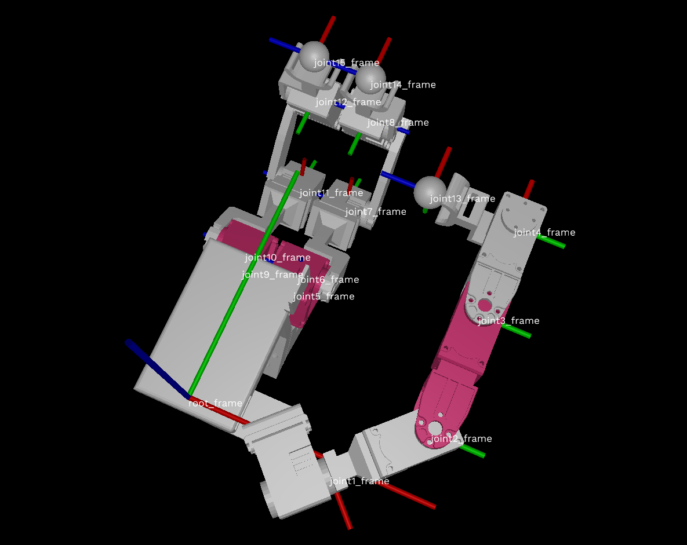

## Exoskeleton Glove EX12

### 3D Printing
The extra componets for the EX12 are listed in `stl` folder.

### Others
* OpenRB-150 motor control boad.
* Type-C USB cable
* 12 Dynamixel XL330-M077-T motors.
* Standard components for XL330-M077-T motors, S101, S102, FPX330.
* EH2.54 3pin connectors.

### Assembly
Assembly all the motors and components together, like followings (home position):


### Zero Position
```python
from libgex.libex12 import Glove
from libgex.utils import search_ports
import time
 
glove = Glove(port="/dev/ttyACM0") # COM* for Windows, ttyACM* or ttyUSB* for Linux
glove.connect(init=False)

print(glove.getj())
# set hand zero, call off() first
glove.off()
glove.set_zero_whole_hand()
print(glove.getj())
```
